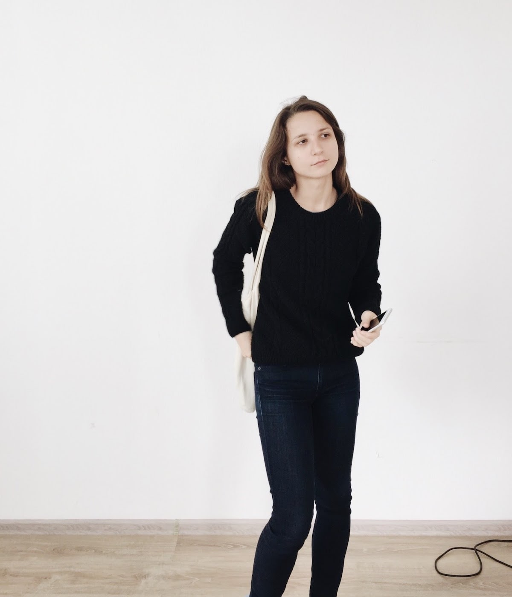

# Ksenia
Product Designer

[CV](https://kseniailinyh.github.io/portfolio/Resume-Ksenia-Ilinykh.pdf) | [Linkedin](https://www.linkedin.com/in/kseniailinykh/) | [Email](mailto:ksenia.ilinyh@gmail.com)

I’m a product designer with over 9 years of SaaS experience working on B2B products: internal billing, CRM, financial analysis system. I have worked in small and big product teams, in a startup, and in an established product.

I love turning chaos into an easy-to-use interface that solves customers’ problems.

[Help Center](https://kseniailinyh.github.io/portfolio/help-center.html)

[Kontur.Class](https://kseniailinyh.github.io/portfolio/class.html)

[Design Wars](https://kseniailinyh.github.io/portfolio/design-wars.html)

[Bureau Guide](https://kseniailinyh.github.io/portfolio/bureau-guide.html)

[Pet Projects](https://kseniailinyh.github.io/portfolio/pet-projects.html)

[Comic](https://kseniailinyh.github.io/portfolio/comic.html)

